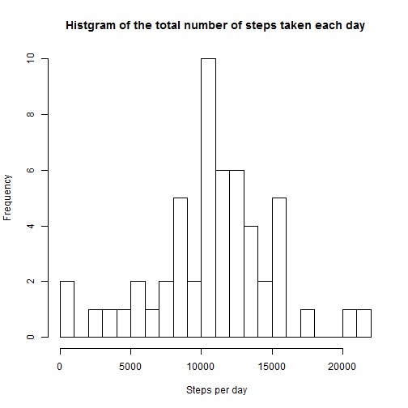
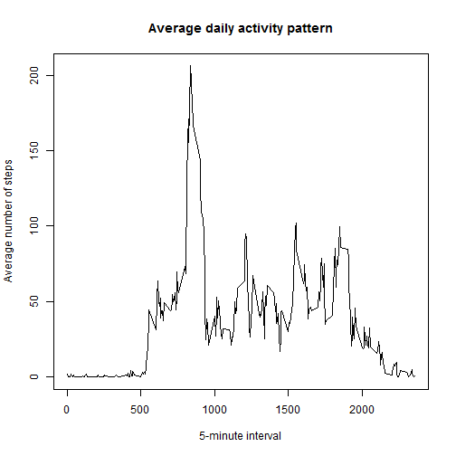
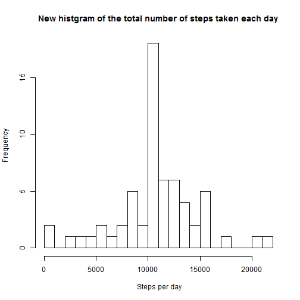
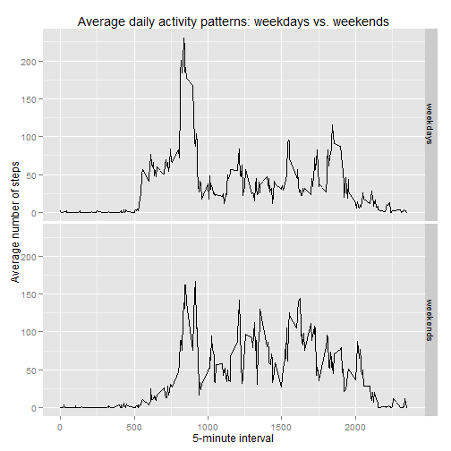

# Reproducible Research: Peer Assessment 1


## Loading and preprocessing the data

```r
Sys.setlocale("LC_TIME", "C")  ## set Locale to 'English' as we process Date type.
```

```
## [1] "C"
```

```r
unzip("activity.zip")
act <- read.csv("activity.csv")
act$date <- as.Date(act$date)  #transform the date from factor into Date format
```


## What is mean total number of steps taken per day?

```r
actTotal <- aggregate(steps ~ date, data = act, FUN = sum)
hist(actTotal$steps, breaks = 20, main = "Histgram of the total number of steps taken each day", 
    xlab = " Steps per day")
```

 

```r
meanTotalSteps <- mean(actTotal$steps, na.rm = TRUE)
medianTotalSteps <- median(actTotal$steps, na.rm = TRUE)
```

The mean total number of steps taken per day is **10766**.  
The median total number of steps taken per day is **10765**.


## What is the average daily activity pattern?

```r
actDaily <- aggregate(steps ~ interval, act, mean)
plot(actDaily$interval, actDaily$steps, type = "l", main = "Average daily activity pattern", 
    xlab = "5-minute interval", ylab = "Average number of steps")
```

 

```r
maxSteps <- actDaily[which.max(actDaily$steps), ]
```

The **835**  5-minute interval contains the maximum number of steps **206**.


## Imputing missing values

```r
sumNA <- sum(is.na(act$steps))
```

The total number of missing values in the dataset is **2304**.  
Create a new dataset by filling the missing values with the mean for that 5-minute interval. Then make a histgram of of the total number of steps talen each day.


```r
newAct <- act
for (i in 1:dim(act)[1]) {
    if (is.na(act$steps[i])) {
        newAct$steps[i] <- as.integer(actDaily$steps[act$interval[i] == actDaily$interval])
    }
}
newActTotal <- aggregate(steps ~ date, data = newAct, FUN = sum)
hist(newActTotal$steps, breaks = 20, main = "New histgram of the total number of steps taken each day", 
    xlab = " Steps per day", )
```

 

```r
meanNewTotalSteps <- mean(newActTotal$steps)
medianNewTotalSteps <- median(newActTotal$steps)
```

The new mean total number of steps taken per day is **10749**.  
The new median total number of steps taken per day is **10641**.  
These values are a little lower than those estimates from the first part of the assignment. Imputing missing data seems to have some negative impact on the estimates of the total daily number of steps.


## Are there differences in activity patterns between weekdays and weekends?
Make a panel plot containing a time series plot (i.e. type = "l") of the 5-minute interval (x-axis) and the average number of steps taken, averaged across all weekday days or weekend days (y-axis) below. 


```r
newAct$weekdays <- weekdays(newAct$date, abbreviate = TRUE)
wd <- c("Mon", "Tue", "Wed", "Thu", "Fri")
newAct$weekdays <- factor(!(newAct$weekdays %in% wd), labels = c("weekdays", 
    "weekends"))
newActDaily <- aggregate(steps ~ interval + weekdays, newAct, mean)
library(ggplot2)
qplot(interval, steps, data = newActDaily, facets = weekdays ~ ., geom = "line", 
    main = "Average daily activity patterns: weekdays vs. weekends", xlab = "5-minute interval", 
    ylab = "Average number of steps")
```

 

There is an apparent difference in activity patterns between weekdays and weekends. It looks people start activity earlier in the morning weekdays than weekends. Probably they want to stay in bed longer in the morning weekends than weekdays.
